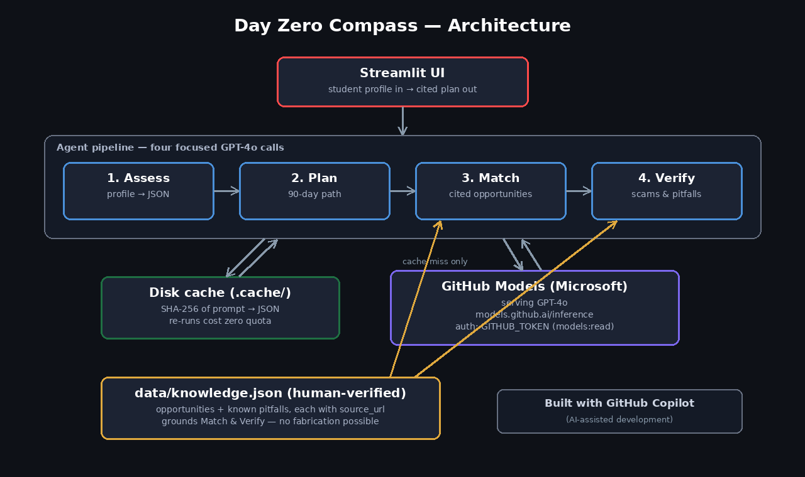

# 🧭 Day Zero Compass

**From Nothing, To Everything.** An AI guidance agent that gives early-stage tech learners in underserved Southeast Nigeria a grounded, cited, scam-aware path into tech — starting from day zero.

*Built for the Microsoft Agents League Hackathon (Creative Apps track).*

## The problem

A motivated 19-year-old in Aba or Owerri who wants to get into cloud engineering faces three walls at once:

1. **No map.** Generic "learn to code" advice ignores their reality: shared devices, daily power cuts, expensive data, no money for courses.
2. **Invisible access barriers.** Real ones — for example, Pearson VUE's payment flow rejecting many Nigerian debit cards, which silently blocks students from sitting AWS certification exams even when they've earned a voucher.
3. **Scams.** Fake scholarships and pay-to-apply "opportunities" specifically target exactly this population.

Generic chatbots make this *worse*: they hallucinate scholarships that don't exist and deadlines that were never real. For a student whose entire budget is one application fee, a hallucinated opportunity isn't an inconvenience — it's a catastrophe.

## How it works

The student enters a short free-form profile. The agent then runs **four visible, sequential steps** — each a separate GPT-4o call with its own focused system prompt:

| Step | What it does |
|---|---|
| 🔍 **Assess** | Parses the profile into structured JSON: level, skills, target track, and constraints (money, power, bandwidth, payment access). Extraction only — no advice, no invention. |
| 🗺️ **Plan** | Produces a sequenced, realistic next-90-days learning path tuned to the level and constraints (free, low-bandwidth resources preferred). |
| 🎯 **Match** | Recommends opportunities **only from `data/knowledge.json`** — a human-verified list of vouchers, scholarships, and resources — citing each entry's `id` and `source_url`. If nothing fits: "No verified match found." |
| 🛡️ **Verify** | A safety pass: surfaces known scams and access pitfalls relevant to this student (with documented workarounds) and teaches them how to verify any opportunity themselves. |



## What this agent will NOT do

This is the core of the project:

- ❌ It will **never invent** a scholarship, voucher, deadline, or URL. The Match and Verify steps are given *only* the entries in the human-verified knowledge file — the model is never asked an open-ended "what opportunities exist?" question.
- ✅ Every recommendation **cites its source** (`id` + `source_url` from the knowledge file).
- 🙅 If nothing in the knowledge base fits, it **says so plainly** instead of filling the gap.
- 🔎 It always ends with **"verify it yourself"** guidance — official domains only, never pay to apply.

This is enforced in the system prompts **and** in code: `agent/pipeline.py` constructs the Match/Verify inputs exclusively from `data/knowledge.json`.

## Stack

Deliberately boring and reliable:

- **Python + Streamlit** — UI and orchestration
- **`openai` SDK → GitHub Models** (`https://models.github.ai/inference`, model `openai/gpt-4o`) — free tier
- **Disk cache** (`.cache/`, SHA-256 of each prompt) — every call is cached, so the demo re-runs without burning the ~50 req/day free-tier quota. A "served from cache" badge shows when a result is cached.
- **`data/knowledge.json`** — the human-verified grounding file

No frameworks, no vector DB, no containers.

**Built with Microsoft:** [GitHub Copilot](https://github.com/features/copilot) for AI-assisted development, and [GitHub Models](https://docs.github.com/en/github-models) for runtime inference (GPT-4o) — both Microsoft.

## Run it locally

```bash
git clone <this-repo> && cd day-zero-compass
python3 -m venv .venv && source .venv/bin/activate
pip install -r requirements.txt
export GITHUB_TOKEN=<your-token>   # see below
streamlit run app.py
```

### Getting a GitHub Models token

1. Go to GitHub → **Settings → Developer settings → Fine-grained personal access tokens**.
2. Create a token with the **`models:read`** permission (under Account permissions → Models).
3. `export GITHUB_TOKEN=github_pat_...`
4. Sanity-check it: `python test_model.py` should print a one-line model response.

On Streamlit Community Cloud, set `GITHUB_TOKEN` in the app's **Secrets** instead.

> **Rate limits:** GitHub Models' free tier allows roughly 50 requests/day. Day Zero Compass caches every response on disk, so repeated runs of the same profile cost zero quota.

## Knowledge base

`data/knowledge.json` holds the verified opportunities and known pitfalls. Every entry carries a `source_url` and a `verified_on` date. **Entries are added by a human after checking the issuer's official site** — that manual verification step is a feature, not a gap.
